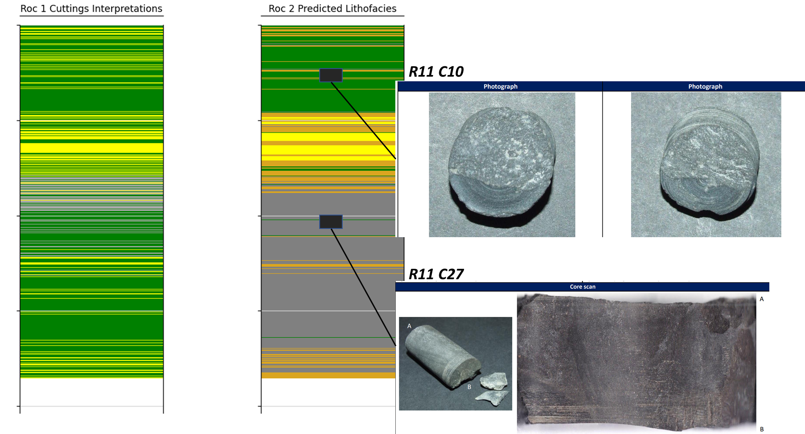

# Unsupervised_Facies_Prediction_WirelineLogs

This repository demonstrates a method for predicting lithofacies using wireline data with a combination of dimensionality reduction and unsupervised machine learning.  The example shown in 'codes/Unsupervised_ML_Wireline.ipynb', invoked a UMAP dimension reduction method on Gamma Ray, Density and Neutron Porosity logs before using the embeddings as input to an unsupervised clustering algorithm.  

The results as shown below consistently represent a series of petrophysical domains that appear to be more consistent than the cuttings descriptions found in the Well Completion Report.  

